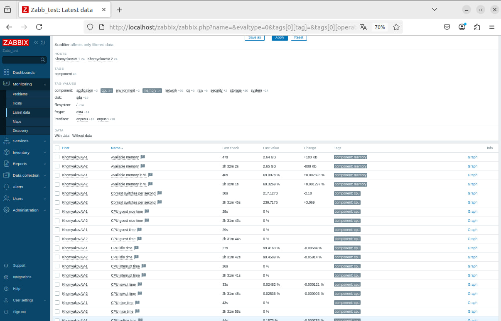
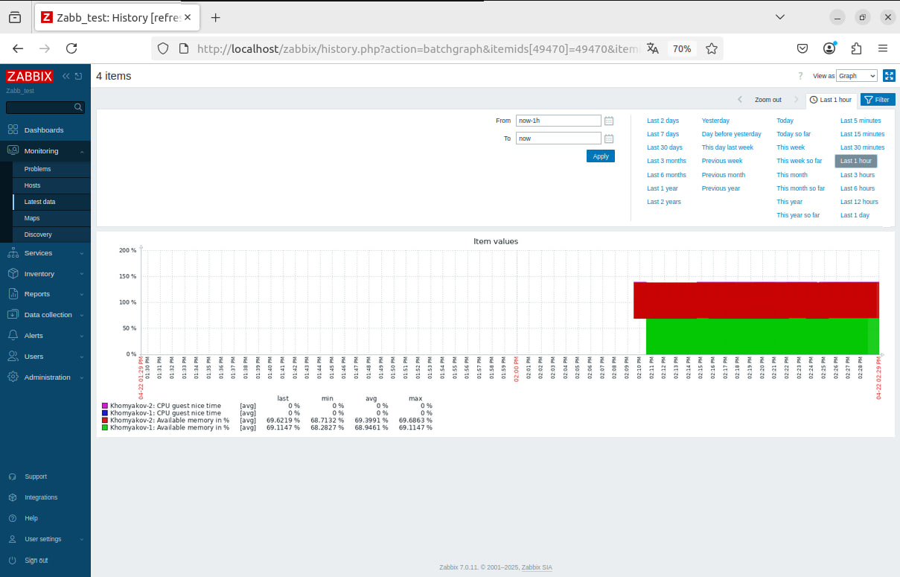
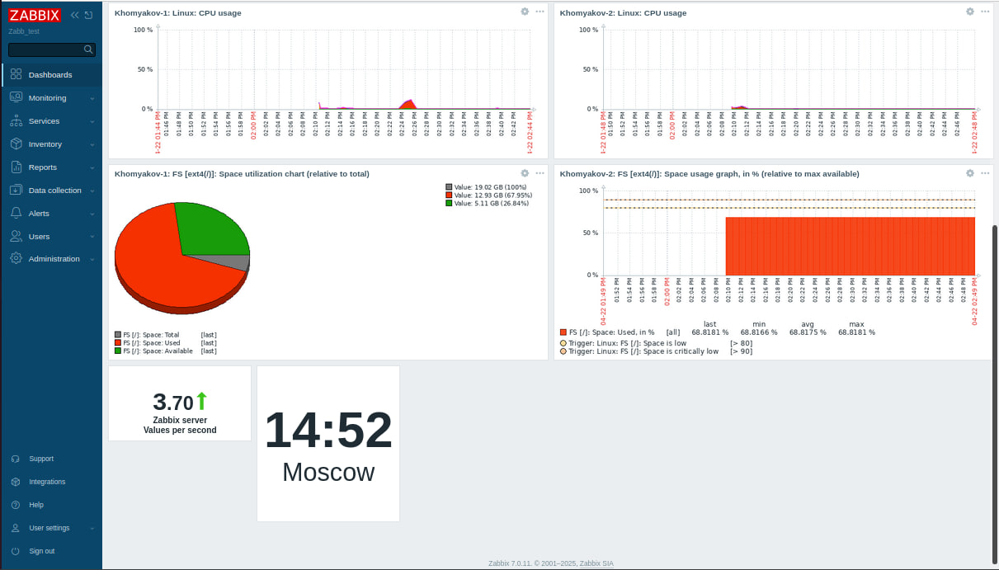

# Домашнее задание к занятию "`Система мониторинга Zabbix. Часть 2`" - `Хомяков Антон`

## Задание 1: Шаблон CPU и RAM
Задание 1: screenshot Создание шаблона CPU usage и RAM usage:

## Задание 2-3: Добавление хостов и привязка шаблонов
Задание 2: screenshot Configuration - Hosts:

Screenshot Latest data:

Задание 3: screenshot Monitoring: 

## Задание 4: Кастомный дашборд
Задание 4: screenshot dashboard:

Screenshot dashboard:

