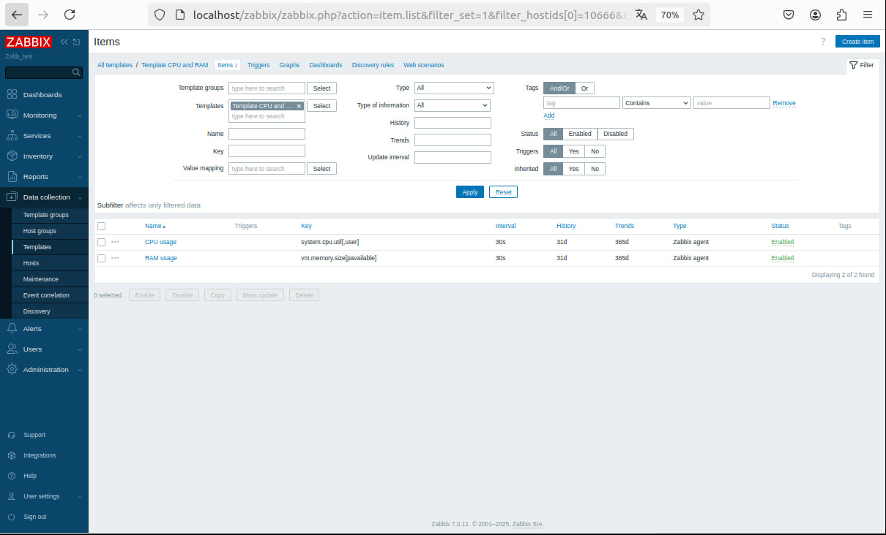
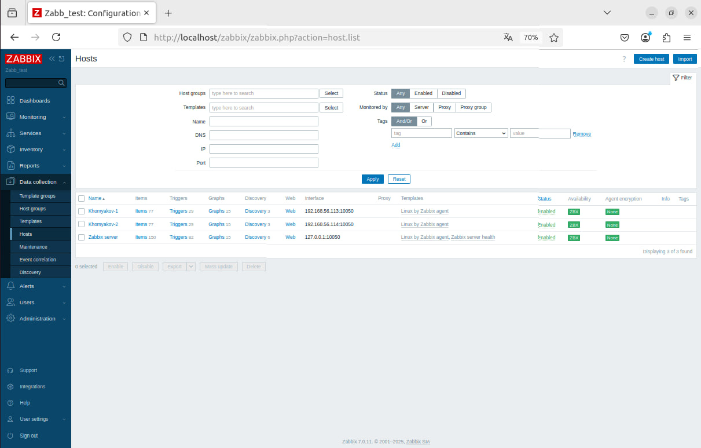
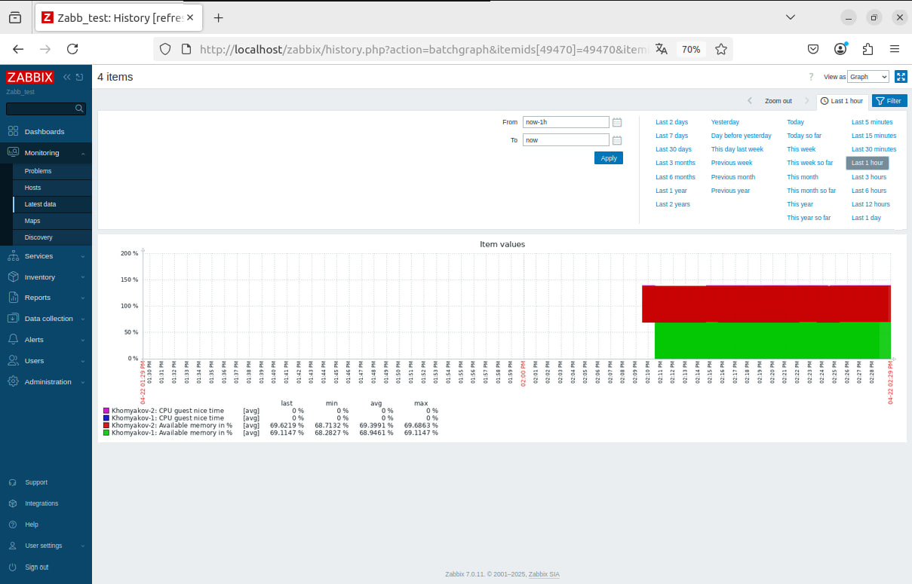

# Домашнее задание к занятию "`Система мониторинга Zabbix. Часть 2`" - `Хомяков Антон`

## Задание 1: Шаблон CPU и RAM
Скриншот создания шаблона:

## Задание 2-3: Добавление хостов и привязка шаблонов
Скриншот Configuration - Hosts:

Скриншот Monitoring - Latest data: 

## Задание 4: Кастомный дашборд
Скриншот 1: 

Скриншот 2:

