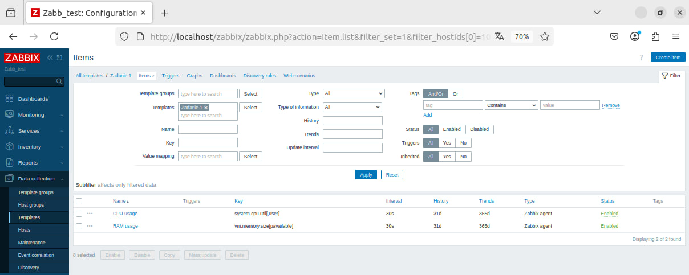
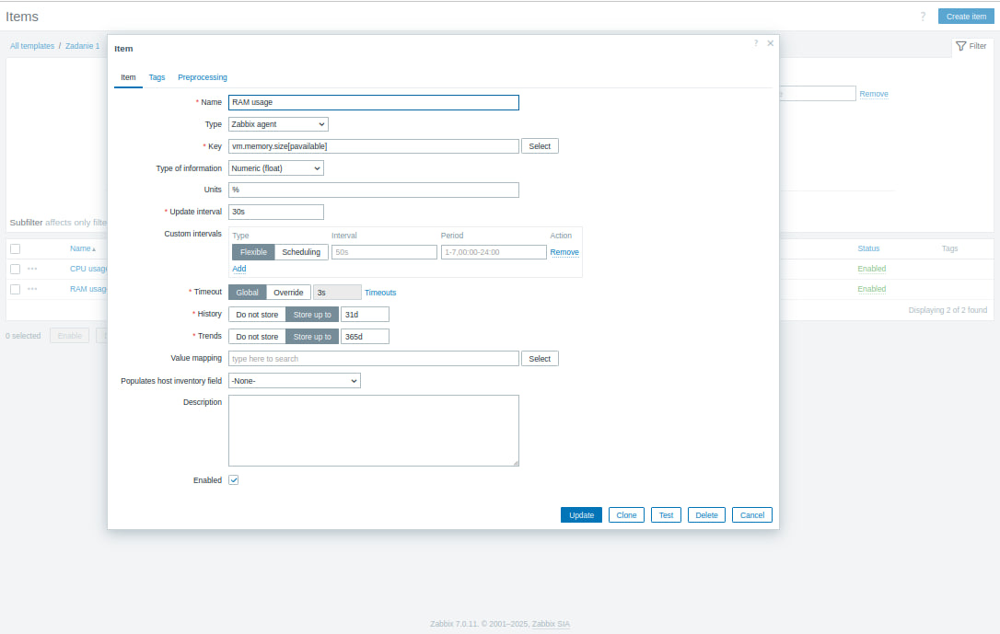
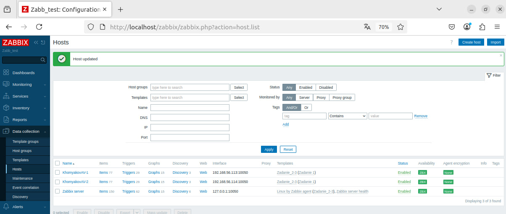
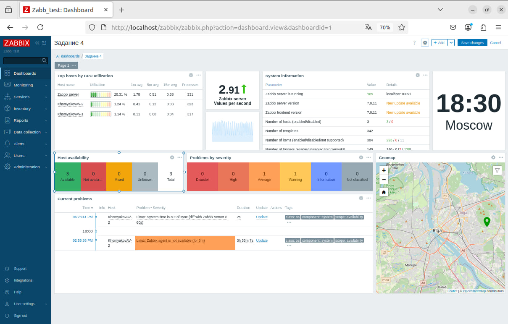

# Домашнее задание к занятию "`Система мониторинга Zabbix. Часть 2`" - `Хомяков Антон`

---

## Задание 1: Шаблон CPU и RAM

Шаблон с именем **«Задание 1»**, содержащий два элемента данных: CPU и RAM usage.

Шаблон:

Элемент CPU:

Элемент RAM:

---

## Задание 2-3: Добавление хостов и привязка шаблонов

### Задание 2

Добавлены два хоста: `Khomyakov-1` и `Khomyakov-2`.

  

### Задание 3

Привязаны шаблоны **Linux by Zabbix Agent** и **Задание 2-3**. Хосты подключены.

  

---

## Задание 4: Кастомный дашборд

Создан пользовательский дашборд с графиками.

  

